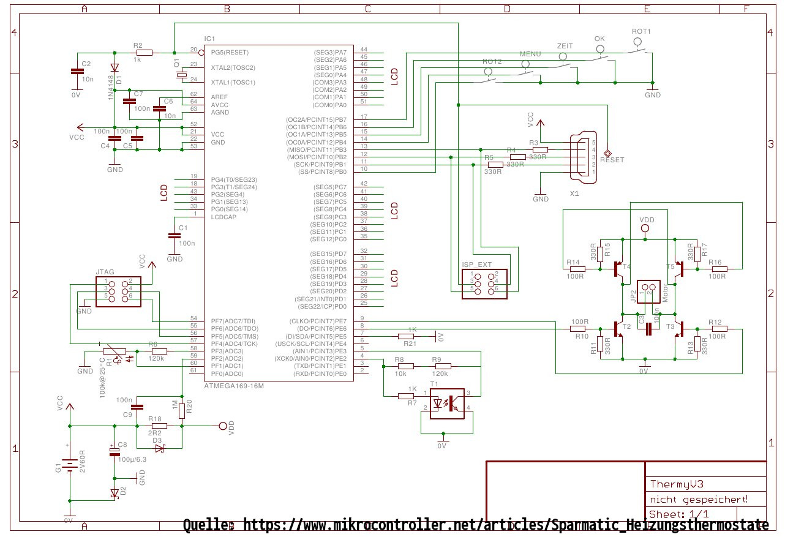

# Sparmatic-Comet
Open Source Firmware for cheap "Sparmatic Comet" thermostat

## Required Features
- [x] Detect Valve Min/Max Position
- [ ] Write Valve Max Position to EEPROM
- [ ] Set Valve Position (Percent) 
- [ ] Read Temperature
- [x] Rotary encoder input
- [ ] Button Inputs
- [x] Control Display
- [ ] Battery Voltage / Power loss detection
- [ ] Communicate via Softserial
- [ ] Wake pin (?)

## Planned Improvements
- [ ] Rotary encoder
- [ ] Code refectoring when everything is working somehow :D

## Schematic
